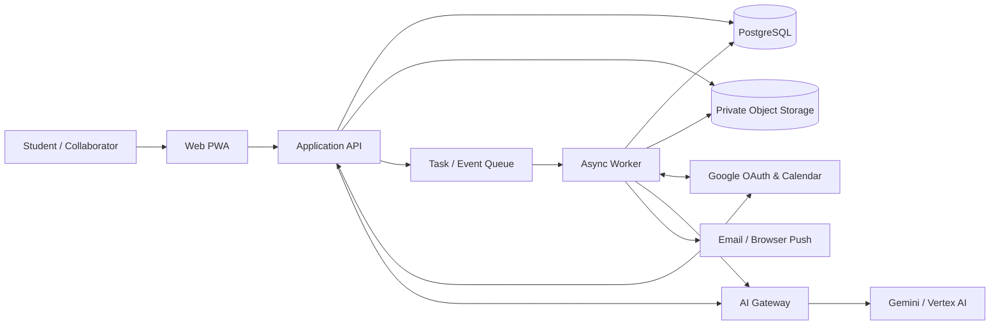
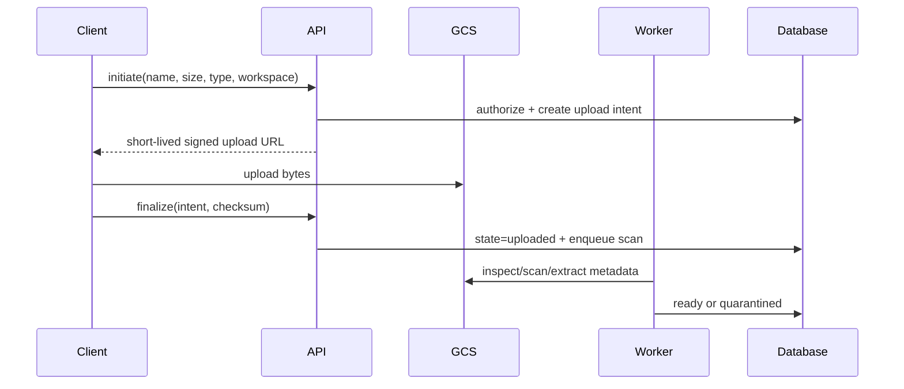
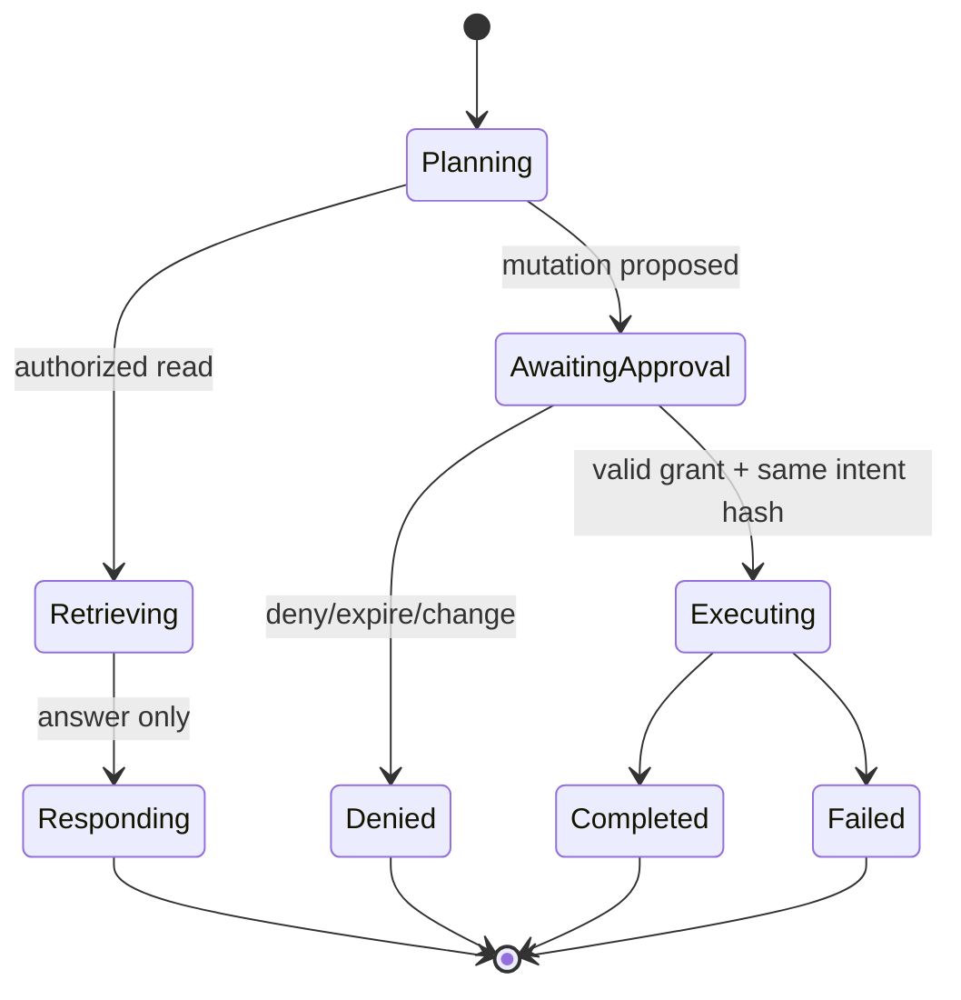

# Arsitektur Sistem

**Status:** Runtime baseline amended by ADR-0004
**Gaya:** Modular monolith + asynchronous workers  
**Target:** Google Cloud, portable pada batas provider adapter

## 1. Keputusan utama

MakeItOrganize dimulai sebagai modular monolith, bukan microservices. Domain dipisahkan ketat dalam code dan data access, tetapi dapat di-deploy sebagai sedikit unit: web/API dan worker. Ini menekan kompleksitas transaksi, observability, dan operasi untuk tim kecil sambil menyediakan seam untuk ekstraksi service saat beban nyata membutuhkannya.

Baseline implementasi yang diusulkan:

- Monorepo TypeScript.
- React/Next.js untuk web/PWA dan server boundary.
- PostgreSQL untuk identity, tenancy, metadata, relasi, sync state, permission, audit index, dan job state.
- Google Cloud Storage (GCS) private bucket untuk binary dan derivative.
- Cloud Run untuk stateless web/API dan worker; Cloud Tasks untuk command terjadwal/retry dan Pub/Sub untuk event fan-out.
- Secret Manager, Cloud Logging/Monitoring/Trace, dan managed PostgreSQL production.
- Vector capability dimulai dari PostgreSQL extension/managed vector yang memenuhi filter ACL; ekstraksi ke vector service hanya dengan ADR.

Implementasi initial release mengikuti ADR-0004: OpenAI Sites/Vinext di Cloudflare Workers, D1, dan R2. Daftar Google Cloud di atas dipertahankan sebagai target migrasi; aturan modular monolith, provider adapter, policy, outbox, sync, dan AI safety tetap normatif.

## 2. Konteks sistem

## 3. Domain modules

| Module | Tanggung jawab | Tidak boleh |
|---|---|---|
| Identity | account, credential, session, linked identity | Menentukan role workspace |
| Workspace | tenant, membership, invitation, role | Mengakses resource tanpa policy |
| Academic | semester, course, relationships | Menyimpan binary |
| Tasks | task lifecycle, reminders, assignment | Mengirim notification langsung |
| Calendar | local event, recurrence, external mapping, sync state | Mempercayai webhook sebagai event content |
| Files | metadata, logical tree, upload state, versions, preview | Membuat bucket public |
| Notes/Canvas | document/version, stroke data, autosave | Menaruh HTML unsanitized |
| Search | lexical/vector index, authorization-aware retrieval | Mengembalikan result sebelum ACL filter |
| AI Orchestration | context, provider, tools, approvals, runs, memory | Bypass domain commands/policy |
| Notifications | preference, scheduling, delivery, deduplication | Mengirim tanpa opt-in/policy |
| Audit | immutable event ledger dan history projection | Menyimpan secret/full content |

Semua mutation melewati application command; UI, webhook, dan AI tool tidak menulis tabel domain langsung.

## 4. Request dan event flow

### 4.1 Synchronous command

1. Authenticate session.
2. Parse dan validate input.
3. Load workspace/resource scope.
4. Evaluate authorization.
5. Jalankan domain transaction + outbox event.
6. Commit.
7. Return resource dan correlation ID.
8. Outbox relay mempublikasikan pekerjaan turunan.

Transactional outbox mencegah kondisi “database tersimpan tetapi event hilang”. Consumer menyimpan processed-event/idempotency key.

### 4.2 File upload

Storage key memakai opaque ID, bukan filename. Signed URL memiliki expiry pendek, content constraints, dan hanya diberikan setelah quota/policy check.

### 4.3 Calendar two-way sync

- Connection menyimpan encrypted OAuth token, selected calendar, `sync_token`, webhook channel metadata, dan health.
- Webhook hanya memverifikasi channel dan enqueue sync; ia bukan payload perubahan.
- Worker melakukan incremental sync, menyimpan page progress, lalu mengganti token secara atomic.
- HTTP 410/invalid token memicu bounded full resync.
- Local outbound change memakai external mapping + idempotency marker.
- Echo dari perubahan outbound dikenali melalui external ID/version agar tidak membuat loop.
- Periodic reconciliation memperbaiki webhook yang terlambat atau hilang.

### 4.4 AI run dan action authorization

AI menghasilkan proposed tool call, bukan SQL/API internal bebas. Policy engine menghitung risk dan capability. Executor memanggil domain command yang melakukan authorization lagi. Approval terikat pada hash actor + action + normalized args + target versions + expiry. Prompt/document adalah data tidak tepercaya dan tidak dapat mengubah policy.

## 5. Retrieval dan indexing

Pipeline per immutable file/note version:

1. Validate ready/authorized source.
2. Detect media type dan pilih extractor allowlist.
3. Extract text/OCR pada sandboxed worker dengan limits.
4. Normalize; simpan extraction metadata dan checksum.
5. Chunk dengan pointer ke page/slide/sheet/section.
6. Embed melalui provider adapter.
7. Index dengan `workspace_id`, `resource_id`, `version_id`, dan ACL scope.
8. Mark index ready; jangan mengganti index version aktif sampai selesai.

Query flow selalu: resolve workspace/grants → build candidate filter → retrieve → revalidate resources → minimize context → call model → render citations. Revocation menutup akses segera melalui authorization query meskipun cleanup embedding asynchronous.

## 6. Deployment topology

### Environment

- `local`: emulator/test doubles bila wajar; Docker untuk PostgreSQL.
- `staging`: project dan OAuth client terpisah, synthetic/non-production data.
- `production`: project, bucket, database, secrets, service accounts, dan billing budgets terpisah.

### Google Cloud baseline

- Cloud Run Web/API: public ingress melalui HTTPS, aplikasi tetap authenticates user.
- Cloud Run Worker: private/internal invocation.
- Managed PostgreSQL: private connection, backups, PITR, connection pooling.
- GCS: uniform bucket-level access, public access prevention, soft delete/lifecycle.
- Cloud Tasks/Pub/Sub: least-privilege service account dan DLQ.
- Secret Manager: runtime access hanya untuk service account terkait.
- Artifact Registry + CI/CD: signed/scanned images dan staged rollout.

Tetapkan region sedekat mungkin dengan mayoritas pengguna dan sesuai data residency. Batas autoscaling harus menjaga koneksi database serta biaya.

## 7. Resilience dan consistency

- Strong transaction untuk metadata domain dalam satu database.
- Eventual consistency untuk search, preview, AI index, notification, dan external sync.
- UI menampilkan `pending`, `syncing`, `ready`, `failed`, serta retry/recovery.
- Circuit breaker/timeouts untuk external provider.
- Setiap job memiliki max attempts, retryable error classification, dedup key, dan DLQ.
- Backup tanpa restore drill bukan strategi recovery; drill dilakukan minimal kuartalan.

## 8. Observability

Setiap request/job/provider call membawa correlation ID. Dashboard operasi minimum:

- error/latency/traffic/saturation per service;
- DB connections, slow query, queue age, retry dan DLQ;
- calendar webhook health dan sync lag;
- upload/indexing success rate dan processing age;
- AI request count, latency, token/cost budget, blocked action, tool outcome;
- notification delivery dan dedup rate;
- authorization denials dan suspicious activity tanpa merekam content sensitif.

## 9. Portability boundaries

Provider-specific code hanya berada di adapter: object storage, calendar, AI, email/push, secrets, dan queue. Domain memakai interface internal. Portability bukan berarti lowest-common-denominator; GCS/Google Calendar capability boleh digunakan, tetapi mapping dan failure semantics harus eksplisit.

## 10. Sumber teknis resmi

- Google Calendar mendukung incremental sync dengan sync token dan mewajibkan full sync saat token invalid: https://developers.google.com/workspace/calendar/api/guides/sync
- Calendar push notification memberi sinyal perubahan melalui HTTPS webhook: https://developers.google.com/workspace/calendar/api/guides/push
- Cloud Run menyediakan stateless HTTPS services dan autoscaling: https://cloud.google.com/run/docs/overview/what-is-cloud-run
- Cloud Storage object recovery/versioning perlu lifecycle policy: https://cloud.google.com/storage/docs/object-versioning
- Gemini API paid usage memerlukan project/billing API sendiri: https://ai.google.dev/gemini-api/docs/billing
