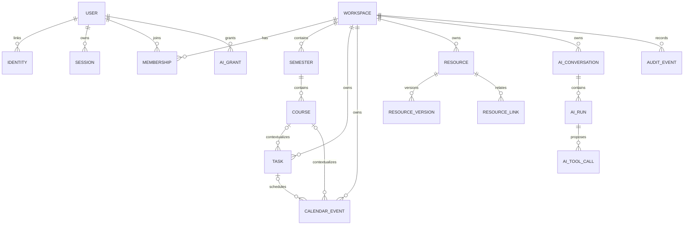

# Model Data Konseptual

**Status:** Proposed  
**Database:** PostgreSQL sebagai sumber kebenaran metadata

## 1. Prinsip

- Primary key opaque UUID/UUIDv7; jangan mengekspos sequential ID.
- Semua tenant-owned row memiliki `workspace_id` dan index gabungan yang sesuai.
- Timestamp UTC: `created_at`, `updated_at`, dan bila relevan `deleted_at`.
- Soft delete untuk user content; immutable row untuk version dan audit.
- Foreign key digunakan untuk integrity; application policy tetap memeriksa authorization.
- Binary tidak disimpan dalam database.
- Metadata fleksibel boleh JSONB, tetapi field yang dicari/diotorisasi harus kolom typed.

## 2. Entity relationship

## 3. Aggregate dan tabel utama

### Identity

- `users`: profile, locale, timezone, status.
- `identities`: provider (`password`, `google`), provider_subject unique, email snapshot, verified state.
- `password_credentials`: hash metadata dan rotation timestamp.
- `sessions`: hashed token ID, device metadata terbatas, idle/absolute expiry, revoked_at.
- `oauth_connections`: encrypted tokens, granted scopes, expiry, provider account, connection health.

Email bukan identifier domain permanen untuk Google; gunakan provider `sub`. Normalized verified email membantu linking, tetapi linking sensitif memerlukan authenticated confirmation.

### Workspace dan policy

- `workspaces`: type `personal|shared`, owner ID, name, settings.
- `memberships`: workspace, user, role, status; unique active membership.
- `invitations`: hashed token, intended email, role, expiry, inviter.
- `resource_grants`: resource, grantee user/membership, capability, expiry.

### Academic dan productivity

- `semesters`: label, start/end date, status.
- `courses`: semester, code, name, color token, status.
- `tasks`: course, assignee, title, description, due_at, timezone, priority, status, completed_at.
- `task_reminders`: task, offset/absolute schedule, channel.
- `calendar_events`: source, title, times, timezone, recurrence, course/task links, sync status.
- `calendar_connections`, `external_calendars`, `calendar_event_mappings`, `calendar_sync_cursors`, `webhook_channels`.

### Unified resource

`resources` menjadi identity bersama untuk file, folder, typed note, dan canvas sehingga link, grant, search, audit target, dan AI citation konsisten.

- `resources`: type, name/title, parent folder, owner, course, lifecycle state.
- `file_objects`: resource, current version, media type, byte size, readiness.
- `resource_versions`: immutable version number, storage key/content document pointer, checksum, actor, source version, created_at.
- `notes`: resource + current editable document/version metadata.
- `canvases`: resource + current stroke document/preview metadata.
- `resource_links`: typed edge (`task_attachment`, `course_material`, `note_reference`, dll.) dengan uniqueness.
- `external_resources`: provider, provider ID, URL, mime family, connection.

Folder adalah logical resource. `parent_id` harus berada pada workspace yang sama; cycle dicegah melalui transaction/recursive check. Untuk skala awal adjacency list cukup; materialized path dapat ditambahkan melalui ADR bila query tree membutuhkannya.

### Search/RAG

- `content_extractions`: resource version, extractor version, status, text object pointer, error code.
- `content_chunks`: extraction, ordinal, locator JSON (page/slide/section), text hash, access scope.
- `embeddings`: chunk, provider/model/dimension, vector, created_at.
- `index_jobs`: requested reason, state, attempt, timings.

Embedding selalu menunjuk immutable version. Hanya satu version ditandai current searchable setelah index lengkap.

### AI

- `ai_conversations`: workspace, creator, scope resource opsional.
- `ai_messages`: role, content pointer/redacted text, status, usage.
- `ai_runs`: provider/model, context envelope, status, budgets, timings.
- `ai_tool_calls`: tool, normalized args, risk, intent hash, approval state, result/error.
- `ai_grants`: user, workspace, capability, scope, mode persistent, expiry/revoked.
- `ai_conversation_grants`: conversation-scoped capability dengan expiry.
- `ai_memories`: user/workspace scope, statement, provenance, confidence, confirmed_at, expiry/deleted_at.

Allow-once melekat pada tool call/intent, bukan reusable grant.

### Audit dan notification

- `audit_events`: append-only actor/action/target/outcome/auth source/redacted diff/correlation.
- `activity_projections`: denormalized user-facing history yang dapat dibangun ulang.
- `notification_preferences`: per user, event type, channel, quiet hours.
- `notifications`: content template/data, read state.
- `notification_deliveries`: channel, dedup key, attempt, provider status.
- `outbox_events`: transactional event publication.
- `processed_events`: consumer idempotency.

## 4. Tenant isolation

Defense in depth:

1. `workspace_id` wajib pada tenant resource.
2. Repository function memerlukan explicit actor + workspace scope.
3. Composite FK/unique constraint mencegah cross-workspace link.
4. PostgreSQL Row Level Security SHOULD diaktifkan untuk tabel sensitif setelah connection-context strategy dibuktikan aman dengan pooling.
5. Search/index membawa tenant key dan ACL predicate.
6. Object key diawali opaque environment/workspace ID tetapi akses tetap via API policy, bukan prefix saja.

## 5. Index dan constraints kritis

- Unique lower-normalized identity per provider subject.
- Satu active owner per workspace melalui transaction + deferred validation.
- Unique `(connection_id, external_calendar_id, external_event_id)`.
- Unique live sibling normalized name bila UX memilih larangan duplicate; jika duplicate diperbolehkan, UI wajib membedakan.
- Unique `(resource_id, version_number)` dan immutable update trigger/policy.
- Unique notification/tool idempotency key per scope.
- Partial indexes untuk active/non-deleted task, resource, membership, dan sync job.

## 6. PII dan klasifikasi

| Kelas | Contoh | Perlakuan |
|---|---|---|
| Restricted | password hash, OAuth refresh token, reset token | Encryption/hashed, akses service terbatas, tidak di-log |
| Confidential | file content, notes, AI prompt, calendar detail | Tenant ACL, encryption, minimized logging |
| Internal | audit metadata, system health, IDs | Authenticated access, retention policy |
| Public | marketing content, public docs | Explicit publishing only |

## 7. Migration policy

- Migration forward-only dan direview.
- Perubahan destruktif memakai expand → migrate/backfill → switch → contract.
- Migration production tidak mengandalkan request startup.
- Backfill besar asynchronous, resumable, dan observable.
- Schema migration, app release, dan rollback compatibility harus tertulis pada PR.

